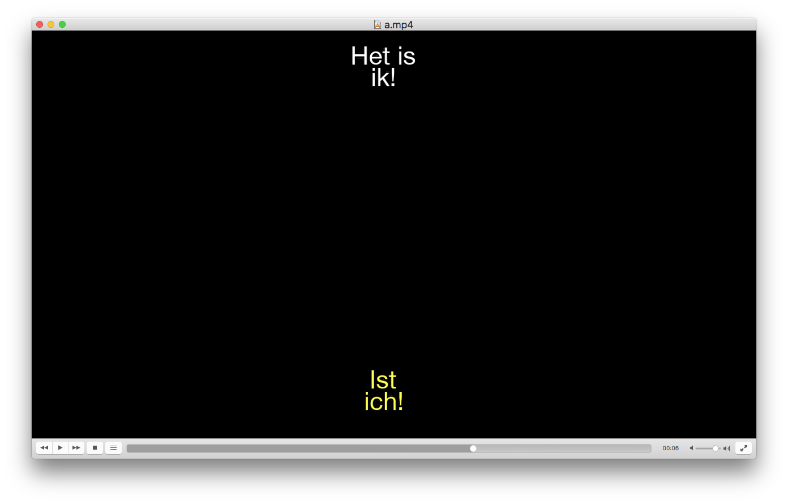

merge-srt-subtitles
============

This is a python3 script powered by srt that allows a user to merge two `.srt` subtitles with different languages, and create one dual-language subtitle.

The primary subtitle will be shown at the bottom of the screen in yellow. The secondary subtitle will be shown at the top of the screen in white.



## Setup
- Clone this repo to your desktop
- Install `srt` library: `pip3 install srt`

---

## Test
After cloning this repo to your desktop and installing the `srt` library, go to its root directory and test:

```
python3 merge_subtitles.py -p de -s nl
```

This tests the script using the primary subtitle `a.de.srt` and secondary `b.nl.srt`, creating the merged file `a.merged.srt`.

---

## Usage examples
The script expects in the working directory two subtitle files, with the filename in the following format: `<title>.<language>.srt`. Example: `a.de.srt`.

Run the script as follows:

```
python3 merge_subtitles.py -p <primary_language> -s <secondary_language>
```

or

```
python3 merge_subtitles.py --primary <primary_language> --secondary <secondary_language>
```

---

## License
>You can check out the full license [here](https://github.com/malfroid/merge-srt-subtitles/blob/master/LICENSE)

This project is licensed under the terms of the **MIT** license.